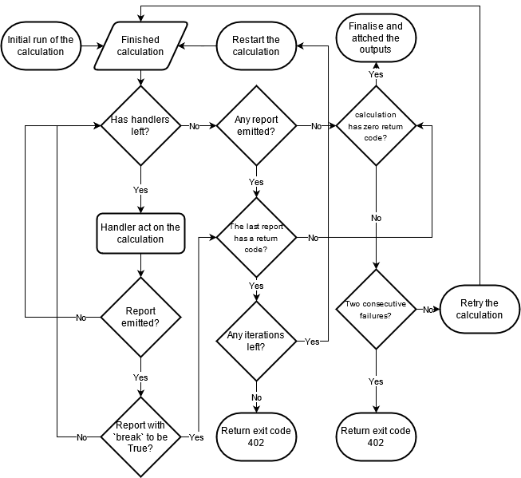

.. _vasp_workchain:

==============
VASP workchain
==============

This is the base `VASP`_ workchain, it is designed so that one can perform any single DFT `VASP`_ run. The behavior of the calculation, i.e. exactly what kind of run is performed, control values, etc. are controlled via the ``parameters`` inputs.

The `VaspWorkChain` is the basis that is used to build the rest of the more specialized workchains, e.g. `RelaxWorkChain` to deal with the structural relaxation.

Required inputs
^^^^^^^^^^^^^^^

The `VaspWorkChain` requires a number of inputs, these comprise the minimum set of information to run a `VASP`_ calculation from `AiiDA`_.

* ``code``, type: :py:class:`aiida.orm.nodes.data.Code`. Describes the VASP executable and holds a reference to the ``Computer`` instance on which it lives.
* ``structure``, type: :py:class:`aiida.orm.nodes.data.StructureData` or :py:class:`aiida.orm.nodes.data.CifData`. Describes the structure on which VASP is to be run.
* ``kpoints``, type: :py:class:`aiida.orm.nodes.data.KpointsData`. The kpoints mesh or path.
* ``potential_family``, type: :py:class:`aiida.orm.nodes.data.Str`. The name given to a set of uploaded POTCAR files.
* ``potential_mapping``, type: :py:class:`aiida.orm.nodes.data.Dict`. Dictionary containing an entry for at least every kind name in the ``structure`` input with the full name of the POTCAR from the ``potential_family``. Example: ``{'In1': 'In_d', 'In2': 'In_h'}``.
* ``parameters``, type: :py:class:`aiida.orm.nodes.data.Dict`. Dictionary with the parameters for the calculation. Please consult the documentation on how parameters are handled (:ref `parameters`) for details, particularly the section pertaining to the ``VaspWorkChain``.
* ``options``, type: :py:class:`aiida.orm.nodes.data.Dict`. Dictionary containing at least the keys ``resources``. More information about the options is available in the `AiiDA documentation`_.

Extra inputs
^^^^^^^^^^^^

The ``VaspWorkChain`` can take other inputs that allow for higher control of the workchain itself.

* ``settings``, type: :py:class:`aiida.orm.nodes.data.Dict`. Dictionary containing parameters not related to `VASP`_ itself, e.g. parser settings, selective dynamics, etc.
* ``wavecar``, type: :py:class:`aiida_vasp.data.WavefunData`. It contains the wavefunctions of the Kohn-Sham equation as stored in the `WAVECAR`_ file. It can be used to restart a calculation in a very efficient manner.
* ``chgcar```, type: :py_class:`aiida_vasp.data.ChargedensityData`. It contains the charge density and the PAW one-center occupancies and can be used for restarting VASP calculation, as stored in the `CHGCAR`_ file.
* ``site_magnetization``, type: :py:class:`aiida.orm.nodes.data.Dict`. Dictionary containing the site dependent magnetization, that can be used to restart the calculation. It currently it is only tested for the collinear case.
* ``restart_folder``, type: :py:class:`aiida.orm.nodes.data.RemoteData`. This is a folder of a previous calculation that can be used as a parent or to restart the calculation.
* ``max_iterations``, type: `AiiDA`_ :py:class:`aiida.orm.nodes.data.Int`, default: 5. How many iterations the restart will be attempted before resulting in failure.
* ``clean_workdir``, type: :py:class:`aiida.orm.nodes.data.Bool`, default: True. Whether or not the remote folder of the calculation will be deleted after the end of the calculation.
* ``verbose``, type: :py:class:`aiida.orm.nodes.data.Bool`, default: False. Whether or not extra information is displayed during the workchain execution.
* ``dynamics.positions_dof``, type: :py:class:`aiida.orm.nodes.data.List`. It controls the selective dynamics of the ions when performing relaxations.

Required outputs
^^^^^^^^^^^^^^^^

A successful `VaspWorkChain` would result in the following outputs always being produced

* ``misc``, type: :py:class:`aiida.orm.nodes.data.Dict`. Dictionary containing the output parameters containing smaller quantities that do not depend on system size.

Extra outputs
^^^^^^^^^^^^^

.. _vasp_workchain_outputs:

Depending on the input variables passed as inputs one or more of the following outputs can be produced

* ``structure``, type: :py:class:`aiida.orm.nodes.data.StructureData`. Output structure from the simulation.
* ``kpoints``, type: :py:class:`aiida.orm.nodes.data.KpointsData`. Output k-points mesh.
* ``trajectory``, type: :py:class:`aiida.orm.nodes.data.TrajectoryData`. Trajectory of the atomic positions.
* ``chgcar``, type: :py:class:`aiida_vasp.data.ChargedensityData`. It contains the charge density and the PAW one-center occupancies and can be used for restarting VASP calculation, as stored in the `CHGCAR`_ file.
* ``wavecar``, type: :py:class:`aiida_vasp.data.WavefunData`. It contains the wavefunctions of the Kohn-Sham equation as stored in the `WAVECAR`_ file.
* ``bands``, type: :py:class:`aiida.orm.nodes.data.BandsData`. The output band structure.
* ``forces``, type: :py:class:`aiida.orm.nodes.data.ArrayData`. The output forces of the calculation.
* ``stress``, type: :py:class:`aiida.orm.nodes.data.ArrayData`. The output stress of the calculation.
* ``dos``, type: :py:class:`aiida.orm.nodes.data.ArrayData`. The output density of states of the calculation.
* ``energies``, type: :py:class:`aiida.orm.nodes.data.ArrayData`. The output total energies.
* ``projectors``, type: :py:class:`aiida.orm.nodes.data.ArrayData`. The output projectors of decomposition.
* ``dielectrics``, type: :py:class:`aiida.orm.nodes.data.ArrayData`. The output dielectric functions.
* ``dynmat``, type: :py:class:`aiida.orm.nodes.data.ArrayData`. The output dynamical matrix.
* ``charge_density``, type: :py:class:`aiida.orm.nodes.data.ArrayData`. The output charge density.
* ``magnetization_density``, type: :py:class:`aiida.orm.nodes.data.ArrayData`. The output magnetization density.
* ``site_magnetization``, type: :py:class:`aiida.orm.nodes.data.Dict`. Dictionary containing the site dependent magnetization.

Restarting calculations
^^^^^^^^^^^^^^^^^^^^^^^

The main difference between a ``VaspWorkChain`` and a  ``VaspCalculation`` is that the former implements a basic logic of restarting failed or unfinished calculations.
The framework of :py:class:`~aiida.engine.processes.workchains.restart.BaseRestartWorkChain` is used with a set of predefined handlers to fix some (but not all) common pitfalls,
such as restarting an ionic relaxation that has run out of the wall time and electronic convergence issues.

Once a calculation is finished, the ``CalculationNode`` is inspected by a series of :py:func:`aiida.engine.process.workchains.restart.process_handler`,
which are executed in the order of descending priority.
Each handler may be tied to a specific list of ``exit_code`` that the calculation may have.
If any problems are found, and the restart can be performed, a ``ProcessHandlerReport`` would be returned and added to a list.
If the ``break`` attribute of the report is set to ``True`` the handling process would be terminated.
Afterwards, the last report is inspected. If it has an none-zero ``exit_code`` the, then the workchain will be aborted with that ``exit_code`` returned, this corresponds to the case where the error cannot be corrected automatically.
Otherwise, it is assumed that calculation should be restarted with the revised inputs.

The flow chart below illustrates how it works coupled with the emission of the ``ProcessHandlerReport`` from the handlers:



For more information, please see the docstring of :py:class:`~aiida.engine.processes.workchains.restart.BaseRestartWorkChain`.

One should note that the handlers included here are not intended to give a comprehensive coverage of all of possible errors from VASP,
but instead we focus on improving the robustness by performing simple corrections that would be the right things to do in most times.

New handlers may be registered by adding the method to :py:class:`~aiida_vasp.workchains.vasp.VaspWorkChain` with the ``process_handler`` decorator.
Alternatively, one can also extended the :py:class:`~aiida_vasp.workchains.vasp.VaspWorkChain` by sub-classing and add more handlers there.


.. _AiiDA: https://www.aiida.net
.. _VASP: https://www.vasp.at
.. _AiiDA documentation: http://aiida-core.readthedocs.io/en/latest/
.. _Workchain: https://aiida.readthedocs.io/projects/aiida-core/en/latest/concepts/workflows.html#work-chains
.. _WAVECAR: https://www.vasp.at/wiki/index.php/WAVECAR
.. _CHGCAR: https://www.vasp.at/wiki/index.php/CHGCAR
